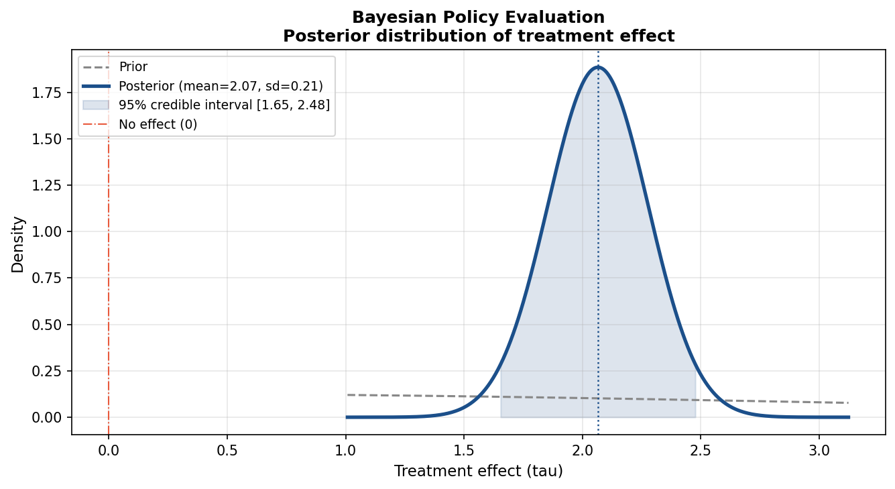

# Bayesian Policy Evaluation

## Business Question
How can we quantify uncertainty in a treatment effect estimate beyond
what frequentist confidence intervals provide? This project applies
Bayesian inference to a simulated policy evaluation, estimating the
full posterior distribution of a treatment effect rather than a
single point estimate.

## Method
- **Model:** Conjugate normal-normal Bayesian update
- **Setup:** Two groups (treated vs. control) with simulated outcome
  data; prior belief about the treatment effect is updated using
  observed data to produce a posterior distribution
- **Output:** Posterior mean, credible interval, and comparison to
  the classical difference-in-means estimator
- **Implementation:** Python (`scipy`, `numpy`, `matplotlib`)

## Key Finding
The Bayesian posterior mean closely matches the classical
difference-in-means estimate, as expected with a weakly informative
prior. The posterior distribution provides a full picture of
uncertainty — including the probability that the treatment effect
exceeds zero — which point estimates alone cannot convey.

## Visualizations


## How to Run
```bash
python bayesian/bayes_posterior_policy_effect.py
```

## Limitations and Next Steps
- The conjugate normal-normal model assumes known variance; a
  full Bayesian model would place a prior on variance as well
- Extending to a hierarchical model would allow partial pooling
  across multiple treatment groups or time periods
- `PyMC` or `Stan` would enable more flexible prior specifications
  for real-world applications

## Tools
Python · NumPy · SciPy · matplotlib