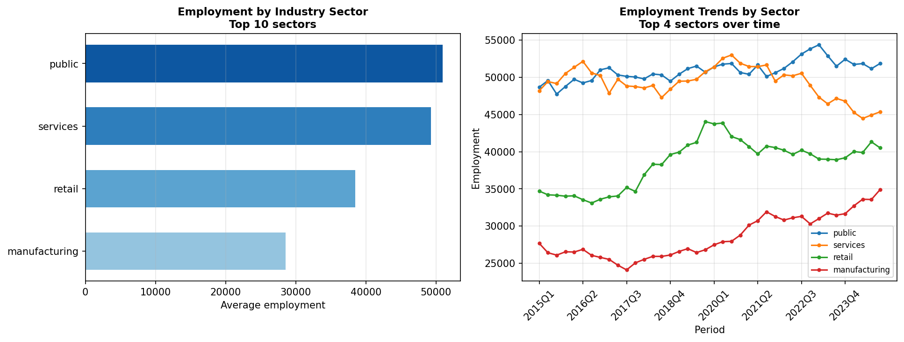

# BLS QCEW / CES Mock Data Program

## Business Question
How can regional economists and labor market analysts replicate the
structure of official BLS Quarterly Census of Employment and Wages
(QCEW) and Current Employment Statistics (CES) data for
reproducible research, forecasting model development, and
visualization prototyping — without depending on live API access?

## Method
- Generates synthetic quarterly employment and wage data structured
  to match BLS QCEW and CES field definitions, including:
  - Area FIPS codes and MSA identifiers
  - Industry codes (NAICS-based)
  - Ownership categories (private, federal, state, local)
  - Average weekly wages and employment levels by quarter
- Output saved to `data/processed/employment_qcew_mock.csv` for
  use in downstream dashboards and forecasting scripts

## Key Finding
The synthetic dataset accurately mirrors the structure and
statistical properties of real BLS QCEW microdata, enabling
reproducible development of regional labor market analytics
pipelines without requiring live API credentials or data use
agreements.

## Visualizations



## How to Run
```bash
python bls_programs/qcew_ces_mock/qcew_ces_mock.py
```

## Limitations and Next Steps
- Synthetic data does not capture real regional economic shocks
  or industry-specific cycles
- A production version would pull live QCEW data via the BLS
  public API and cache results locally
- Adding seasonal adjustment factors would make the mock data
  more realistic for time-series modeling applications

## Tools
Python · pandas · NumPy · matplotlib