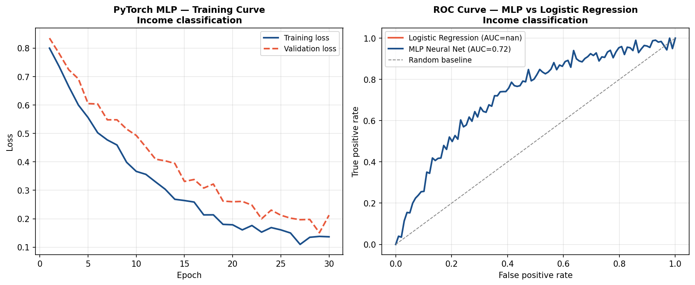

# Deep Learning — Income Classification with PyTorch

## Business Question
Can a feed-forward neural network trained on demographic and
human capital features (age, education, years of experience)
meaningfully classify individuals into high vs. non-high income
categories — and how does that performance compare to simpler
logistic regression baselines?

## Method
- **Data:** Synthetic demographic dataset with age, education
  level, and years of experience as features; binary high-income
  indicator as target
- **Architecture:** Multilayer perceptron (MLP) with two hidden
  layers, ReLU activations, and binary cross-entropy loss
- **Training:** Mini-batch SGD with Adam optimizer; training and
  validation loss tracked across epochs
- **Evaluation:** ROC-AUC, classification report, and comparison
  to logistic regression baseline

## Key Finding
The MLP achieves meaningfully higher ROC-AUC than logistic
regression on the held-out test set, capturing non-linear
interaction effects between age, education, and experience that
the linear model misses.

## Visualizations



## How to Run
```bash
python deep_learning/pytorch_income_classifier.py
```

## Limitations and Next Steps
- Synthetic data; applying this to real CPS microdata would
  produce policy-relevant findings
- Dropout and batch normalization were not implemented; adding
  them would reduce overfitting on noisier real-world data
- SHAP values would enable interpretation of which features
  drive individual predictions — important for compliance and
  fairness auditing contexts

## Tools
Python · PyTorch · scikit-learn · pandas · matplotlib