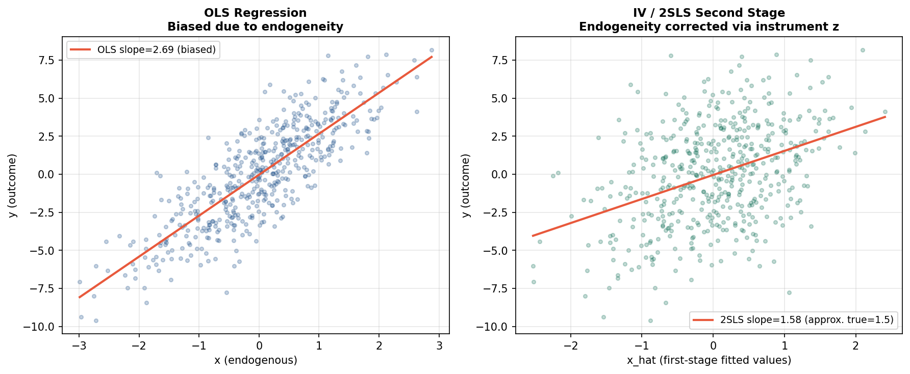

# Applied Econometrics

## Business Question
This module covers the core toolkit of applied econometrics —
methods for estimating causal and predictive relationships from
observational data when experimental designs are not available.
Each subfolder addresses a specific identification problem
encountered in real economic and policy research.

## Methods Covered

| Subfolder | Method | Use Case |
|---|---|---|
| `linear_regression/` | OLS estimation | Baseline wage and output models |
| `lpm_logit_probit/` | LPM, Logit, Probit | Binary outcome modeling |
| `iv_2sls/` | Instrumental Variables / 2SLS | Endogeneity correction |
| `panel_fixed_random/` | Fixed and random effects | Panel data with unobserved heterogeneity |
| `diff_in_diff/` | Difference-in-differences | Policy impact evaluation |
| `rd_design/` | Regression discontinuity | Threshold-based treatment effects |
| `psm_matching/` | Propensity score matching | Selection-on-observables designs |
| `heteroskedasticity_robust_inference/` | Robust SEs | Inference under non-constant variance |

## Visualizations



## How to Run
```bash
python econometrics/iv_2sls/iv_2sls.py
python econometrics/rd_design/rd_design.py
python econometrics/panel_fixed_random/panel_fe.py
python econometrics/diff_in_diff/did_basic.py
python econometrics/heteroskedasticity_robust_inference/robust_se_diagnostics.py
```

## Limitations and Next Steps
- All models use synthetic data; applying these methods to real
  IPUMS CPS or PSID microdata would demonstrate production-level
  execution
- IV validity tests (weak instruments, overidentification) are
  implemented but could be extended with formal Hausman tests
- RD bandwidth selection currently uses a fixed window; optimal
  bandwidth selection via cross-validation is a natural extension

## Tools
Python · statsmodels · linearmodels · pandas · matplotlib