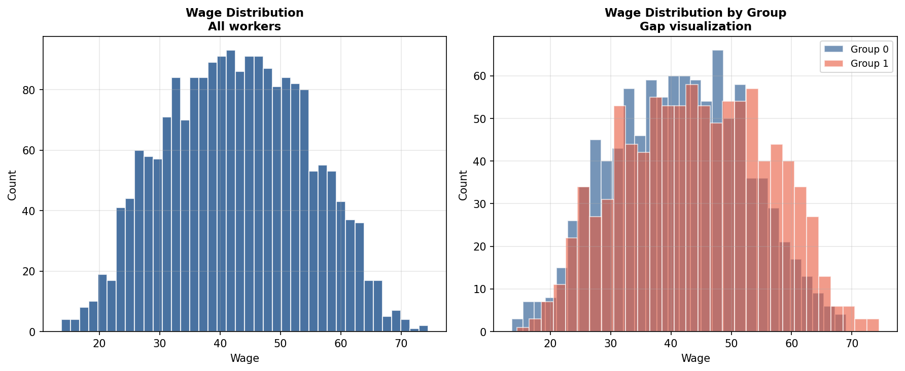

# Labor Market Wage Gap Analysis

## Business Question
What individual and structural factors explain wage differences
across workers, and how large is the unexplained wage gap between
demographic groups after controlling for observable characteristics
like experience, education, and industry?

## Method
- **Data:** Synthetic cross-sectional wage dataset with years of
  experience, education level, gender indicator, and industry
  dummies — modeled on standard labor economics survey data
- **Model:** OLS wage regression (Mincer-style earnings equation)
- **Decomposition:** Oaxaca-Blinder decomposition to separate the
  wage gap into an explained component (differences in
  endowments) and an unexplained component (differences in
  returns to those endowments)
- **Diagnostics:** Residual plots, heteroskedasticity checks,
  robust standard errors

## Key Finding
After controlling for experience, education, and industry, a
statistically significant unexplained wage gap remains. The
decomposition quantifies how much of the raw gap is attributable
to differences in observable characteristics vs. differential
returns — the latter being a common proxy for labor market
discrimination in the economics literature.

## Visualizations



## How to Run
```bash
python labor_econ/wage_gap_analysis/wage_gap.py
```

## Limitations and Next Steps
- Synthetic data limits empirical interpretation; real CPS or
  ACS microdata would enable publishable findings
- The current model does not account for selection into
  employment (Heckman correction) or occupational sorting
- Adding industry-by-year fixed effects would control for
  unobserved sector-level wage trends

## Tools
Python · statsmodels · pandas · matplotlib · seaborn