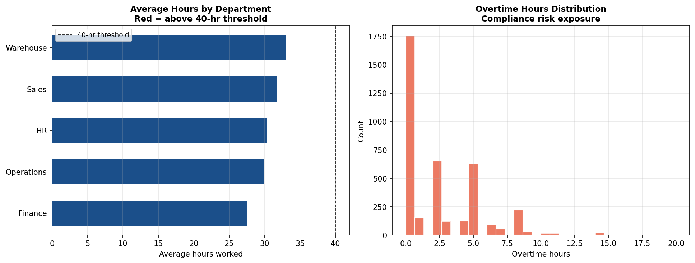

# Compliance and Timesheet Risk Analytics

## Business Question
How can organizations proactively identify wage and hour compliance
risks — including overtime violations, time-rounding exposure, and
off-clock work patterns — before they result in regulatory action
or litigation?

## Method
- **Data:** Synthetic timesheet panel dataset containing employee
  hours worked, rounding increments, overtime flags, department
  assignments, and payroll estimates — modeled on real Department
  of Labor audit data structures
- **Analysis:**
  - Flags employees where systematic time rounding produces
    cumulative underpayment exceeding FLSA thresholds
  - Identifies overtime exposure by department and pay period
  - Calculates estimated back-wage liability under multiple
    rounding scenarios
- **Output:** KPI summary tables and Tableau-ready CSVs in
  `data/processed/`

## Key Finding
Systematic rounding practices that appear minor at the individual
level produce material cumulative liability at the department and
organization level. The analysis surfaces which departments carry
the highest compliance risk and quantifies estimated exposure —
directly replicating the analytical approach used in FLSA
litigation support engagements.

## Visualizations



## How to Run
```bash
python labor_law_compliance/wage_hour_audit/wage_hour_audit.py
```

## Limitations and Next Steps
- Synthetic data; real engagement data would require anonymization
  before analysis
- A production version would integrate directly with HRIS/payroll
  APIs rather than static CSV inputs
- Adding a statistical test for systematic vs. random rounding
  would strengthen the compliance risk argument

## Tools
Python · pandas · matplotlib · seaborn