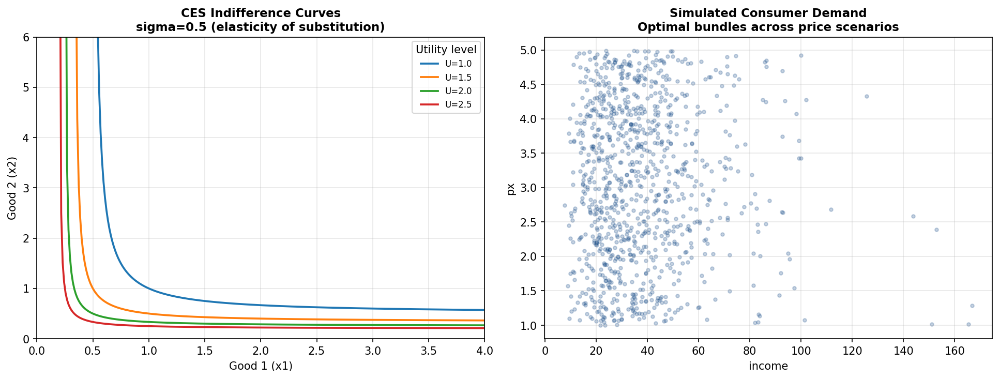

# Microeconomic Modeling — CES Demand Estimation

## Business Question
How do consumers allocate spending across goods when relative
prices change, and how can we estimate the elasticity of
substitution that governs that behavior? The Constant Elasticity
of Substitution (CES) utility function is a workhorse model in
trade, industrial organization, and consumer demand analysis.

## Method
- **Model:** CES utility maximization with two goods,
  parameterized by the elasticity of substitution (sigma)
- **Simulation:** Generates synthetic consumer choice data
  under varying price and income levels
- **Estimation:** Recovers the elasticity of substitution from
  simulated data using non-linear least squares
- **Visualization:** Indifference curves, budget constraints,
  and optimal consumption bundles across price scenarios

## Key Finding
The estimated elasticity of substitution recovers the true
parameter accurately from synthetic data, validating the
estimation procedure. Higher sigma values produce flatter
indifference curves and stronger substitution responses to
relative price changes — a key input to trade policy and
welfare analysis.

## Visualizations



## How to Run
```bash
python micro_models/ces_demand/ces_utility.py
```

## Limitations and Next Steps
- Extending to multiple goods (N > 2) would enable application
  to real consumer expenditure data
- Nested CES structures are widely used in computable general
  equilibrium (CGE) models — a natural extension for trade
  policy analysis
- Calibrating to BLS Consumer Expenditure Survey data would
  produce empirically grounded elasticity estimates

## Tools
Python · NumPy · SciPy · matplotlib