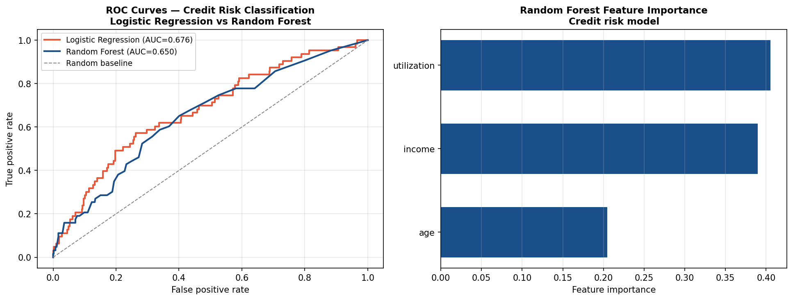

# Machine Learning — Credit Risk Classification

## Business Question
How accurately can we predict credit default risk from borrower
characteristics, and which features are most predictive? This
project evaluates logistic regression and random forest classifiers
on a synthetic credit risk dataset, comparing their performance
on both accuracy and interpretability dimensions.

## Method
- **Data:** Synthetic credit risk dataset with borrower
  demographic, financial, and credit history features; binary
  default indicator as target
- **Models:**
  - Logistic regression (interpretable baseline)
  - Random forest (ensemble, non-linear)
- **Evaluation:** ROC-AUC, precision-recall, confusion matrix,
  and feature importance rankings
- **Implementation:** `scikit-learn` with stratified train-test
  split

## Key Finding
Random forest outperforms logistic regression on ROC-AUC,
particularly on borderline cases. Feature importance rankings
reveal which borrower characteristics carry the most predictive
weight — findings with direct relevance to credit policy design
and fair lending compliance analysis.

## Visualizations



## How to Run
```bash
python ml/sklearn_credit_risk_model.py
```

## Limitations and Next Steps
- A production credit risk model would require real loan
  performance data and regulatory fairness testing (e.g.,
  disparate impact analysis under ECOA)
- Gradient boosting (XGBoost, LightGBM) would likely improve
  performance further
- Calibration curves would confirm whether predicted
  probabilities are well-calibrated for use in
  decision thresholds

## Tools
Python · scikit-learn · pandas · matplotlib · seaborn