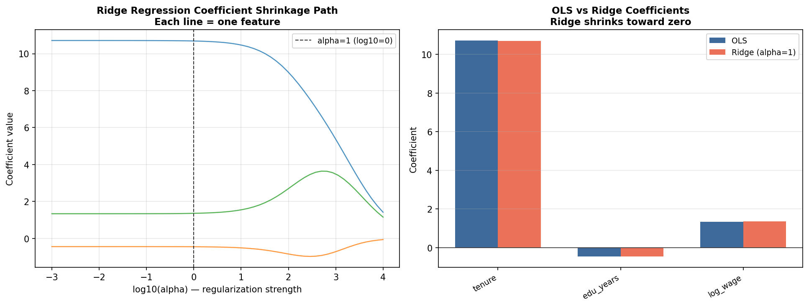

# Regularized Regression Modeling

## Business Question
When predicting labor market outcomes from high-dimensional feature
sets — where predictors are correlated and OLS overfits — how do
regularization methods like Ridge regression improve out-of-sample
forecast accuracy while preserving interpretability?

## Method
- **Data:** Synthetic employment-related wage dataset with
  correlated demographic and job-characteristic predictors
- **Models fitted:**
  - OLS (baseline)
  - Ridge regression (L2 penalty)
- **Comparison:** In-sample R², out-of-sample RMSE via
  cross-validation, and coefficient shrinkage paths as the
  regularization parameter alpha varies
- **Implementation:** `scikit-learn` with `StandardScaler`
  preprocessing

## Key Finding
Ridge regression reduces out-of-sample prediction error relative
to OLS when predictors are correlated, by shrinking unstable
coefficients toward zero without eliminating them entirely. The
optimal alpha is selected via cross-validation.

## Visualizations



## How to Run
```bash
python regression/regularized_employment_regression.py
```

## Limitations and Next Steps
- Lasso (L1) and Elastic Net are natural next steps — Lasso
  performs variable selection, which Ridge does not
- A real application would use actual ACS or O*NET wage data
- Adding cross-validation curves for alpha selection would make
  the hyperparameter tuning process more explicit

## Tools
Python · scikit-learn · pandas · matplotlib