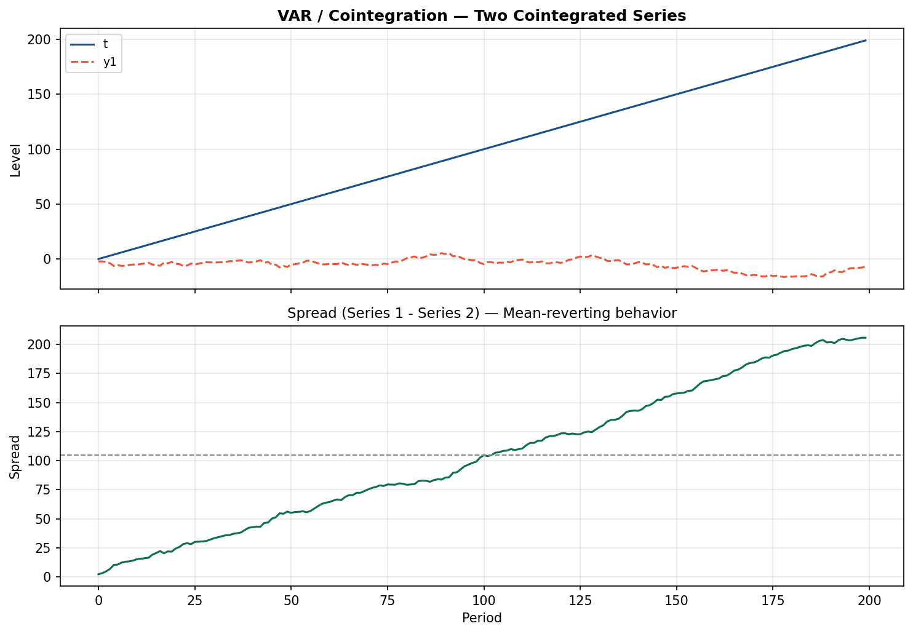
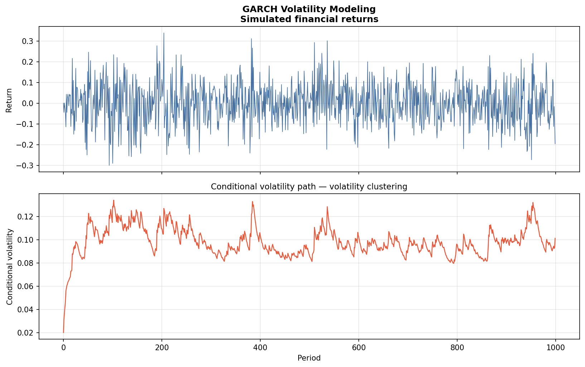

# Macro and Time-Series Economic Modeling

## Business Question
How do macroeconomic variables like GDP, inflation, and financial
returns evolve over time, and how can we model their dynamics,
forecast future values, and quantify volatility? This module
covers three complementary time-series methods applied to
simulated macroeconomic data.

## Projects in This Module

### ARIMA GDP Forecasting (`arima_gdp/`)
- Fits an ARIMA model to a simulated GDP growth series
- Produces multi-step-ahead forecasts with confidence intervals
- Visualizes trend, residuals, and forecast trajectory

### VAR / IRF / Cointegration (`var_irf_cointegration/`)
- Models two cointegrated macroeconomic series using a
  Vector Autoregression (VAR)
- Estimates impulse response functions (IRF) to trace how a
  shock to one variable propagates through the system over time
- Tests for cointegration using the Engle-Granger procedure

### GARCH Volatility Modeling (`garch_volatility/`)
- Simulates financial return data with time-varying volatility
- Fits a GARCH(1,1) model using the `arch` library
- Visualizes volatility clustering and conditional variance paths

## Visualizations




## How to Run
```bash
python time_series/arima_gdp/arima_simulated.py
python time_series/var_irf_cointegration/var_irf_coint.py
python time_series/garch_volatility/garch_demo.py
```

## Limitations and Next Steps
- All data are synthetic; a production version would use real
  FRED or BLS data pulled via API
- ARIMA order selection here is manual; auto-ARIMA (`pmdarima`)
  would improve robustness
- GARCH extensions (EGARCH, GJR-GARCH) would capture asymmetric
  volatility responses to positive vs. negative shocks

## Tools
Python · statsmodels · arch · pandas · matplotlib